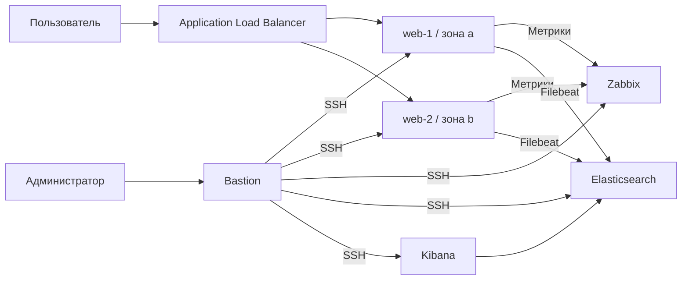

# Дипломная работа по профессии «Системный администратор»

## Инфраструктура сайта в Yandex Cloud

Учебный проект в рамках обучения в Нетологии.

### Цель работы

Развернуть инфраструктуру веб-сайта в Yandex Cloud, настроить мониторинг, централизованный сбор логов и резервное копирование. Для создания облачных ресурсов использовать Terraform, для настройки серверов - Ansible.

### 1. Архитектура

В ходе работы я развернул шесть виртуальных машин. Два сервера nginx находятся в приватных подсетях разных зон доступности. Запросы пользователей поступают на Application Load Balancer. Для администрирования внутренних узлов используется bastion.



| ВМ | Подсеть | vCPU | RAM | Назначение |
|---|---|---|---|---|
| bastion | public-a | 2 | 2 ГБ | SSH-доступ и запуск Ansible |
| web-1 | private-a | 2 | 2 ГБ | nginx, Filebeat, Zabbix Agent 2 |
| web-2 | private-b | 2 | 2 ГБ | nginx, Filebeat, Zabbix Agent 2 |
| zabbix | public-a | 2 | 4 ГБ | Мониторинг и PostgreSQL |
| elasticsearch | private-a | 2 | 4 ГБ | Хранение логов |
| kibana | public-a | 2 | 2 ГБ | Просмотр и поиск логов |

На ВМ установлена Ubuntu 22.04. Используется платформа `standard-v3`, гарантированная доля CPU - 20%, загрузочные диски - HDD по 10 ГБ. Все ВМ переведены в непрерываемый режим.

Веб-серверы находятся в двух зонах, но ALB размещён только в `ru-central1-a`. Zabbix и Elasticsearch также не продублированы, поэтому устойчивость всего стенда к отказу зоны не обеспечена.

### 2. Сеть и безопасность

Созданы VPC и три подсети:

| Подсеть | Диапазон | Зона |
|---|---|---|
| public-a | `10.10.1.0/24` | `ru-central1-a` |
| private-a | `10.10.10.0/24` | `ru-central1-a` |
| private-b | `10.10.20.0/24` | `ru-central1-b` |

Для выхода приватных ВМ в интернет настроены NAT gateway и таблица маршрутизации. У веб-серверов и Elasticsearch нет публичных IP.

Группы безопасности разрешают HTTP к веб-серверам от ALB, SSH к внутренним узлам от bastion и необходимые соединения между сервисами. Административные интерфейсы доступны только с разрешённых IP. Все правила описаны внутри ресурсов групп безопасности Terraform.

### 3. Веб-сайт и балансировщик

На обоих веб-серверах с помощью Ansible установлен nginx и размещена одинаковая [страница сайта](ansible/files/index.html).

Для ALB созданы целевая группа, группа backend-серверов, HTTP router и virtual host. Балансировщик принимает HTTP-запросы на порту 80. Проверка состояния backend-серверов выполняется запросом к `/`.

Адрес сайта на момент проверки: **http://158.160.217.21/**.

### 4. Мониторинг

Для мониторинга установлен Zabbix 7.0. На серверах работают Zabbix Agent 2. Для web-1, web-2, bastion, Elasticsearch и Kibana используется шаблон `Linux by Zabbix agent active`. Технические имена хостов соответствуют FQDN из inventory.

В dashboard `Diplom - USE` добавлены CPU, RAM, заполнение дисков, сетевой трафик, время ответа сайта и текущие проблемы. Для оценки насыщения и ошибок используются load average, очередь диска, задержки чтения/записи, сетевые ошибки и отброшенные пакеты.

На графиках CPU указаны пороги 70% и 90%, заполнения файловой системы - 80% и 90%. Для памяти используется порог шаблона Linux 90%.

HTTP-сценарий `Diplom website` проверяет код ответа 200 и контрольную строку страницы. Настроены триггеры ошибки сценария и среднего времени ответа более 2 секунд за 5 минут.

Хосты, сценарий и dashboard создавались через интерфейс Zabbix. Их экспорт пока не добавлен в репозиторий.

### 5. Централизованный сбор логов

Filebeat на веб-серверах отправляет access- и error-логи nginx в Elasticsearch. Для публикации событий создан отдельный пользователь `filebeat_writer`. Версия Elastic Stack - 8.19.21.

В Kibana создан data view `nginx-*`. При проверке в Discover были найдены события обоих веб-серверов. Тестовые ошибки получены с помощью [test-nginx-error.yml](ansible/test-nginx-error.yml): playbook вызывает HTTP 403 через временный каталог и затем удаляет его.

Логи сохраняются как текст в поле `message`. Для фильтрации используются `host.name` и `event.dataset`. Поле `@timestamp` отражает время обработки записи Filebeat; разбор времени запроса и отдельных полей nginx не настроен.

### 6. Резервное копирование

В [snapshots.tf](terraform/snapshots.tf) настроено расписание `diplom-daily` для загрузочных дисков всех шести ВМ:

- ежедневно в 19:00 UTC - 03:00 следующего дня по Иркутску;
- хранение снимков в течение 7 дней;
- cron-выражение `0 19 * * *`.

Расписание описано в Terraform. Подтверждение фактически созданных снимков ещё необходимо приложить. Восстановление из снимка в рамках текущей проверки не выполнялось.

### 7. Автоматизация и структура проекта

Terraform создаёт облачные ресурсы. Ansible настраивает операционные системы и сервисы. Управляющий узел Ansible - bastion, inventory содержит внутренние FQDN серверов.

```text
.
├── README.md       # Отчёт, порядок запуска и проверки
├── terraform/      # Конфигурация инфраструктуры
├── ansible/        # Установка и настройка сервисов
└── screenshots/    # Скриншоты
```

Terraform state, IAM-токены, приватные SSH-ключи и файлы с паролями не включены в репозиторий. Пароли сервисов вводятся интерактивно.

Порядок установки и ручные этапы приведены ниже. Для нового стенда нужно заменить публичные ключи, административные IP и путь backend. Полное повторное развёртывание с нуля ещё не проверено.

### 8. Порядок запуска

#### Terraform


Требуются Terraform `>= 1.5, < 2.0`, авторизованный CLI `yc` и настроенные cloud/folder. Рабочая версия Terraform стенда - 1.5.7.

**Для существующего стенда используйте только его существующий state.** Backend указывает на `/home/cloudshell-user/yandex-diplom/state/terraform.tfstate`. Пустой или другой state может привести к плану повторного создания ресурсов. В репозиторий state не включён.

Перед развёртыванием нового стенда:

1. Замените публичные SSH-ключи в `bastion.tf`, `web.tf`, `zabbix.tf`, `logging.tf` на свои. Приватных ключей в репозитории нет.
2. Укажите свой IP в `terraform.tfvars`, созданном по примеру. Внутри групп bastion и zabbix также сохранён дополнительный IP `193.233.19.224/32`: замените его своим или удалите соответствующие блоки только если этот доступ не нужен.
3. Настройте отдельный путь backend для нового стенда. Не используйте state действующего проекта для независимой копии.

В Cloud Shell исполняемые файлы провайдера размещались в `/tmp`, поскольку домашняя файловая система ограничивает изменение прав. Для существующего стенда работайте из текущей рабочей папки, где уже настроен Terraform. Для новой рабочей копии исходники можно разместить в `/tmp`, сохранив state по постоянному пути backend.

Из каталога `terraform`:

```bash
cp terraform.tfvars.example terraform.tfvars
# Отредактировать terraform.tfvars, ключи и backend до запуска.
export YC_CLOUD_ID="$(yc config get cloud-id)"
export YC_FOLDER_ID="$(yc config get folder-id)"
export YC_TOKEN="$(yc iam create-token)"
terraform init
terraform fmt -check
terraform validate
terraform plan -out=deploy.tfplan
```

Просмотрите план. Для намеренного развёртывания примените `terraform apply deploy.tfplan`. При истечении IAM-токена получите новый и повторите план. Секреты, state и планы исключены из Git.

Правила доступа задаются внутри ресурсов `yandex_vpc_security_group`. Не добавляйте отдельные ресурсы правил для этих же групп.

#### Подготовка Ansible

Управляющий узел - bastion, пользователь `ubuntu`. Скопируйте каталог `ansible` в `~/yandex-diplom/ansible` на bastion. Inventory использует внутренние FQDN; с обычного внешнего компьютера эти имена напрямую недоступны.

```bash
sudo apt-get update
sudo apt-get install -y ansible
cd ~/yandex-diplom/ansible
ansible-galaxy collection install -r requirements.yml
```

Ключ управления ожидается в `/home/ubuntu/.ssh/ansible`. Для нового стенда создайте его на bastion (`ssh-keygen -t ed25519 -f ~/.ssh/ansible`) и установите его публичную часть в `~ubuntu/.ssh/authorized_keys` всех управляемых ВМ. Существующий ключ не перезаписывайте.

Для web и Zabbix публичный ключ Ansible необходимо проверить и при необходимости добавить в `authorized_keys` до запуска playbook. Logging-ВМ получают ключи через cloud-init `user-data`.

При первом SSH-подключении к каждому узлу сверяйте fingerprint перед сохранением known_hosts. Проверка ключей хостов в `ansible.cfg` включена.

```bash
ansible all -m ping
```

#### Установка сервисов

Команды выполняются на bastion из `~/yandex-diplom/ansible`. Пароли запрашиваются интерактивно. На работающем стенде не повторяйте инициализацию паролей без необходимости.

```bash
ansible-playbook web.yml
ansible-playbook zabbix-install.yml
ansible-playbook zabbix-configure.yml
ansible-playbook elastic-repository.yml
ansible-playbook elastic-install.yml
ansible-playbook elasticsearch-configure.yml
```

Elastic Stack зафиксирован на 8.19.21, пакеты устанавливаются из зеркала, указанного в playbook. После первого запуска Elasticsearch задайте пароли пользователей на его ВМ. С bastion:

```bash
ssh -t -i ~/.ssh/ansible ubuntu@elasticsearch.ru-central1.internal \
  'sudo /usr/share/elasticsearch/bin/elasticsearch-reset-password -u elastic -i'
ssh -t -i ~/.ssh/ansible ubuntu@elasticsearch.ru-central1.internal \
  'sudo /usr/share/elasticsearch/bin/elasticsearch-reset-password -u kibana_system -i'
```

Сохраните пароли вне репозитория. Затем:

```bash
ansible-playbook kibana-configure.yml
ansible-playbook filebeat-prepare.yml
ansible-playbook filebeat-configure.yml
ansible-playbook agents.yml
```

В `filebeat-configure.yml` введите тот же пароль `filebeat_writer`, что был задан в `filebeat-prepare.yml`.

#### Настройка интерфейсов

Zabbix: завершите мастер `/zabbix/`, выбрав PostgreSQL, БД и пользователя `zabbix`, пароль из `zabbix-configure.yml`. Настройте часовой пояс, смените первоначальный пароль администратора.

Создайте хосты web-1, web-2, bastion, elasticsearch и kibana. Техническое имя каждого хоста должно совпадать с полным FQDN в inventory; шаблон - `Linux by Zabbix agent active`. Для самого сервера Zabbix используется локальный агент. Создание хостов и dashboard в этих playbook не автоматизировано.

Web-сценарий `Diplom website`: шаг `Homepage`, URL ALB, ожидаемый код 200, обязательная строка из `ansible/files/index.html`, timeout 10 секунд. На стенде настроены триггеры ошибки сценария и среднего времени ответа более 2 секунд за 5 минут.

Dashboard `Diplom - USE`: CPU (пороги 70/90%), RAM, заполнение корневой ФС (80/90%), сетевой трафик, HTTP response time, Problems, load average, сетевые ошибки и отброшенные пакеты, disk utilization/queue/await. Для Zabbix Linux template использовался порог RAM 90%. Экспорт настроек пока не включён.

Kibana: войдите интерактивным пользователем (не `kibana_system`), создайте data view `nginx-*` с полем времени `@timestamp`. В Discover проверяйте `host.name`, `event.dataset` и `message`. Filebeat передаёт access/error как текстовые сообщения, без разбора полей nginx; время события - время обработки записи, а не извлечённое время запроса.

### 9. Проверка работы


```bash
cd ~/yandex-diplom/ansible
ansible all -m ping
ansible web -b -m command -a 'systemctl is-active nginx filebeat zabbix-agent2'
ansible monitoring -b -m command -a 'systemctl is-active apache2 zabbix-server postgresql zabbix-agent2'
ansible elasticsearch -b -m command -a 'systemctl is-active elasticsearch zabbix-agent2'
ansible kibana -b -m command -a 'systemctl is-active kibana zabbix-agent2'
ansible monitoring -m uri -a 'url=http://127.0.0.1/zabbix/ status_code=200'
ansible-playbook test-nginx-error.yml
```

Последний playbook создаёт временный каталог для получения HTTP 403 и удаляет его. В Kibana проверьте новые `nginx.error` от обоих web-хостов. `CHANGED` у ad-hoc command не означает, что systemctl изменил сервисы.

С внешнего компьютера проверьте актуальный адрес ALB:

```powershell
curl.exe --noproxy "*" -I --max-time 15 http://158.160.217.21/
```

### 10. Результаты проверки


| Проверка | Результат |
|---|---|
| Terraform plan после исправления правил доступа | `No changes` |
| nginx, Filebeat и Agent 2 на обоих web-узлах | Сервисы активны |
| Elasticsearch, Kibana и их агенты | Сервисы активны |
| Веб-интерфейс Zabbix | HTTP 200, dashboard отображает метрики |
| Логи nginx в Kibana | Найдены access- и error-события обоих web-узлов |
| Расписание резервного копирования | Настроено для шести дисков |
| Фактические снимки и восстановление | Требуют отдельного подтверждения |

Последний успешный план Terraform выполнен 03.10.2026: `No changes`. Команды повторной проверки приведены в предыдущем разделе.

### 11. Доступ к стенду


| Сервис | Адрес на 03.10.2026 |
|---|---|
| Сайт | http://158.160.217.21/ |
| Bastion | `93.77.188.150` |
| Zabbix | http://111.88.244.102/zabbix/ |
| Kibana | http://93.77.178.118:5601/ |
| Elasticsearch | `10.10.10.34`, внутренняя сеть |

Подключение к bastion из Windows:

```powershell
ssh -o ConnectTimeout=30 -i "C:/Users/workb/.ssh/yandex-diplom" ubuntu@93.77.188.150
```

Актуальные адреса выводятся командой `terraform output`. Для доступа проверяющего к административным интерфейсам необходимо разрешить его IP. Учётные данные передаются отдельно.

### 12. Скриншоты и оставшиеся проверки

### Виртуальные машины


### Балансировщик


### Сайт


### Мониторинг


### Логи


### Резервное копирование


### Проверка Terraform


### Вывод

В ходе работы я развернул учебный стенд с двумя веб-серверами за балансировщиком, настроил мониторинг, сбор логов и расписание резервного копирования. Исходники Terraform и Ansible сохранены в репозитории. Перед сдачей осталось собрать указанные выше подтверждения.
